# Walmart Sales Analysis

## Introduction
Walmart is a store, specializes in a wide range of consumer goods and has a strong market presence in city. Despite this success, recent revenue and profit trends have not met expectations, prompting concern among the management team about the company's growth trajectory and future sustainability.
## Objective
The primary objective of this project is to leverage SQL analytical techniques, including subqueries and SQL functions, to uncover potential issues impacting revenue & profit. The goal is to gain actionable insights that can inform strategic decisions to improve the Walmart Revenue & Profit performance and overall market position.
## Task
1. Data Extraction: Load csv file dataset into MySQL Workbench.

2. Data Cleaning and Transformation: Ensure data accuracy and consistency through cleaning and transformation processes.

3. Analytical Techniques: Subqueries To perform detailed analyses, such as quantity comparisons or segment-specific performance.

## Data & Resource Used

**Dataset**

Option 1: [Kaggle](https://www.kaggle.com/datasets?fileType=csv)

**Tool** 

MySQL Workbench

## Data Cleaning and Preparation
### 1. Extract the data by utilize SQL queries to extract relevant data from the tables.
Checking NULL values, blanks and Errors.

Removing duplicates, and irrelevant columns.

Ensure data consistency and accuracy through cleaning and transformation processes.
### 2. Create a schema, which is nothing but a database.

Ensure the table includes all required columns for analysis.

Exploring Walmart Sales Table Data that are present in the walmartsaleportfolio database
### 3. Key Analysis Areas
1. Product Analysis

2. Sales Analysis

3. Customer Analysis

4. Revenue and Profit Analysis

## Data Analysis

1.	**Product Analysis:**

	Examination of the performance of different products, including sales volume, revenue generated, and profitability. This analysis helps identify the best-selling products and underperforming items.

2.	**Sales Analysis:**

	Analysis of overall sales performance, including trends over time, peak sales periods, and seasonal variations. This includes breaking down sales by day of the week, time of day, and month.

3.	**Customer Analysis:**

	Insights into customer behavior, demographics, and purchase patterns. This analysis aims to understand customer preferences, frequency of purchases, and customer segmentation.

4.	**Revenue and Profit Analysis:**

	Calculation of key financial metrics, including total revenue, profit margins, and comparison of revenues and profits across different product categories and time periods. These calculations are crucial for assessing the financial health of Walmart's sales operations and making strategic business decisions.

## Key Findings
### 1. Exploratory Data Analysis
• **In which city is each branch.**

**Insight:** Yangon has A branch, Naypyitaw has B branch, and Mandalay has C branch.

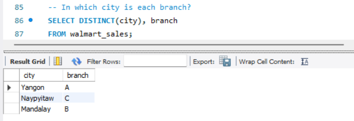

### 2. Product Analysis 

• **The most common payment method.**   

**Insight:** Cash is the most common method compare to other count.

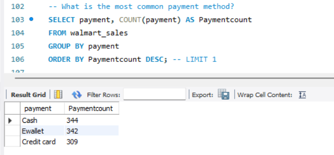  

• **The most selling product line.**   

**Insight:** Fashion accessories has 178 salescount, second, is food & beverages which is 174, and third electronic accessories which is 169.

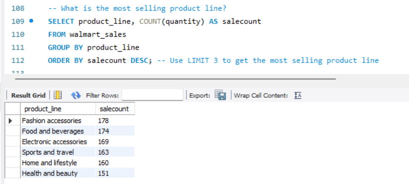  

• **The largest revenue city.**   

**Insight:** Fashion accessories has 178 salescount, second, is food & beverages which is 174, and third electronic accessories which is 169.

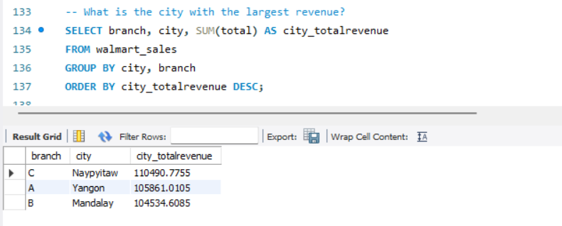 

• **Checking the product line is above or below average sales in terms of "GOOD" or "BAD".**   

**Insight:** All 6 product line are below average sales. walmart should focus on improving the sales.

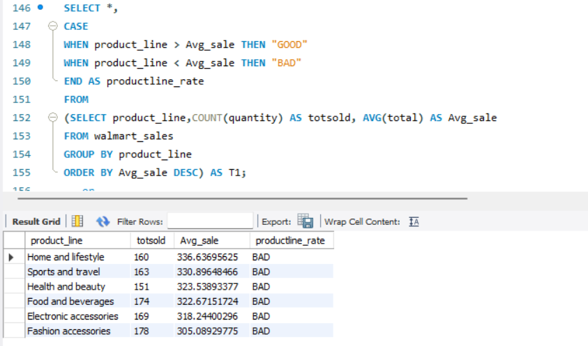

• **Finding which branch sold more products than average product sold.**   

**Insight:** Branch A(Yangon) sold more product 

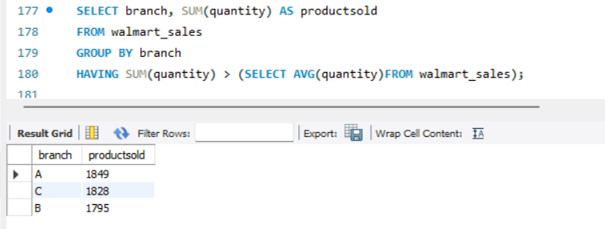 

### 3. Sales Analysis 

• **Number of sales made in each time of the day per weekday.**   

**Insight:** Evenings experience most sales, the stores are filled during the evening hours.

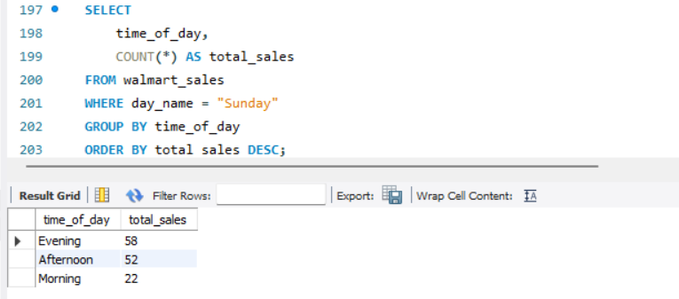  

• **Finding which of the customer types brings the most revenue.**   

**Insight:** Member type customer brings more revenue compare to normal.

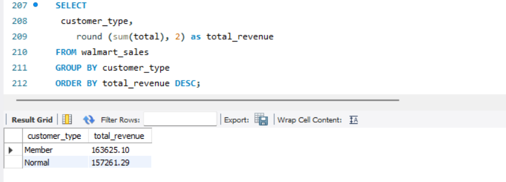 

### 3. Customer Analysis 

• **Finding the gender distribution per branch.**   

**Insight:** Gender per branch is more or less the same hence, I don't think has an effect of the sales per branch and other factors.

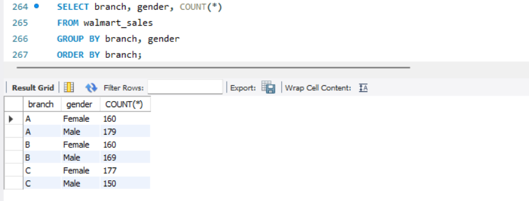

• **Finding which time of the day do customers give most ratings.**   

**Insight:** Looks like time of the day does not really affect the rating, its more or less the same rating each time of the day.

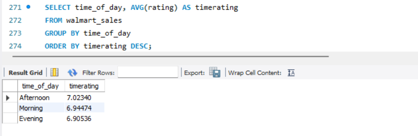

• **Finding which time of the day do customers give most ratings per branch.**   

**Insight:** Branch A and C are doing well in ratings, branch B needs to do a little more to get better ratings.

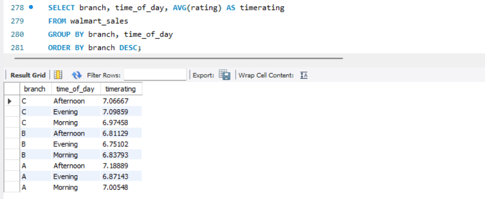

### 4. Revenue and Profit Analysis 

• **Finding COGs.**   

**Insight:** Very few have less than 100 count.

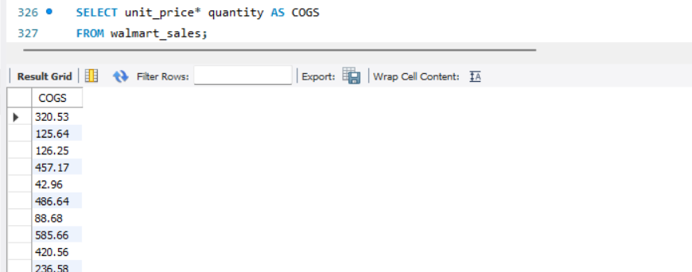 

## Conclusion
This project provides a comprehensive analysis of Walmart's sales data, leveraging feature engineering and exploratory data analysis techniques. The insights gained from this analysis are intended to inform strategic decisions that can enhance sales performance, optimize product offerings, and ultimately improve profitability. The findings will be used to create visual dashboards and reports for stakeholders, providing a clear and actionable summary of the data analysis results.
## Recommended Analysis
• Further analysis of customer type and feedback to identify areas for product or service improvement.

• Exploration of new market opportunities or product lines to stimulate sales growth.

• Implementation of predictive analytics to forecast future sales trends and inform strategic planning.

## Reflection
This project highlights the importance of data-driven decision-making in identifying business challenges and opportunities. The use of SQL for data extraction and analysis enabled a detailed examination of various aspects of the business, providing a solid foundation for strategic improvements.
